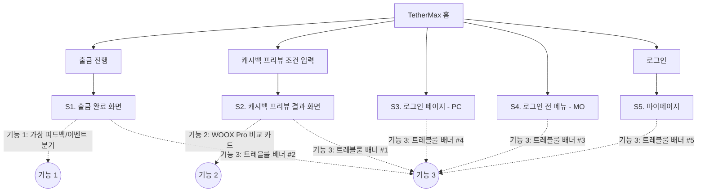
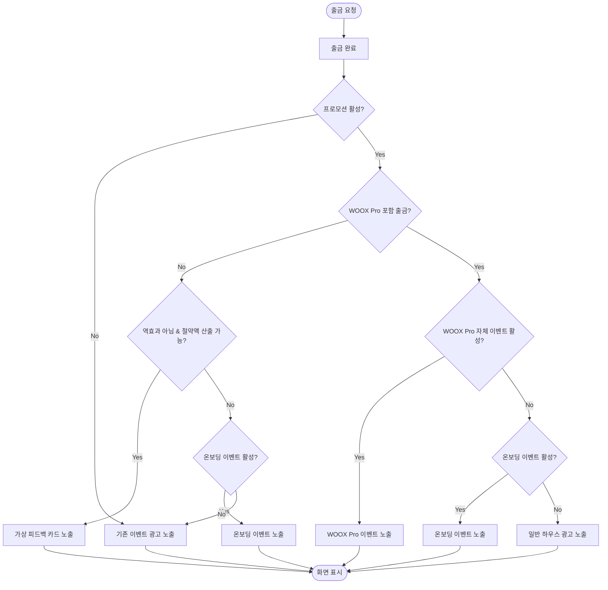
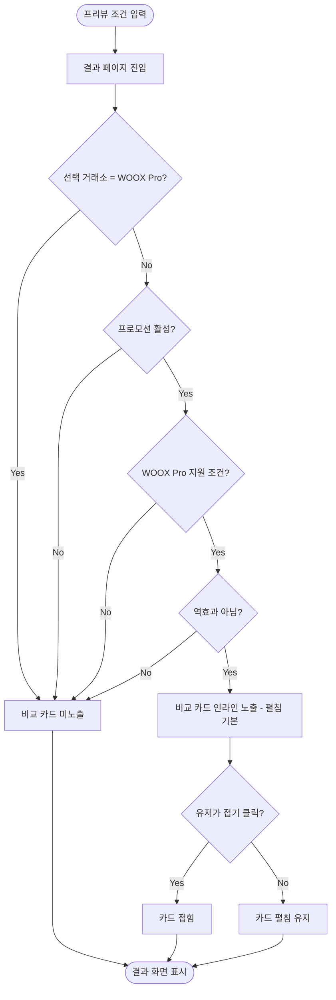
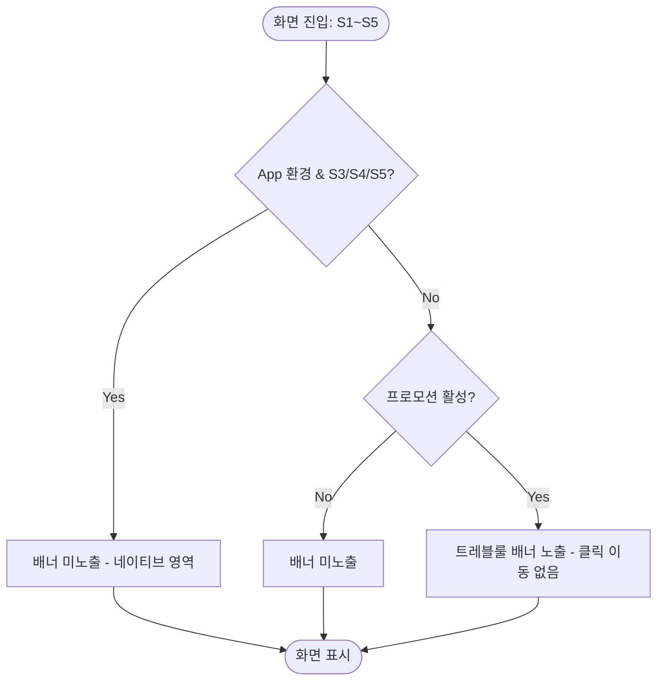

# 정보구조도 (Information Architecture)

| 항목 | 내용 |
|---|---|
| 프로젝트명 | WOOX Pro 온보딩 기념 30일 집중 프로모션 |
| 작성일 | 2026-07-03 |
| 버전 | v1.0 |
| 참조 문서 | 02.기획문서/기능명세서_FE.md, 02.기획문서/화면변경목록.md, PRD.md |

> 본 프로젝트는 신규 사이트를 만드는 것이 아니라 **기존 TetherMax 플랫폼의 5개 화면(S1~S5)에 넛지 기능을 추가**하는 것이다. 아래 사이트맵은 전체 IA가 아니라 이번 프로젝트가 개입하는 지점만을 표시한다. 실제 URL 경로는 기존 플랫폼 라우팅을 따르며 본 문서의 URL은 예시 표기다(⚠️ 실 라우트는 FE 개발 착수 시 확인 필요).

---

## 1. 전체 사이트맵 (프로젝트 개입 지점)

- S1·S2는 Web PC·Web MO·App(웹뷰) 공통
- S3·S4·S5는 Web(PC/MO)만 해당 — App은 해당 화면이 네이티브 영역이라 이번 프로젝트 범위 밖 (화면변경목록.md §1 참조)

---

## 2. 사용자 흐름 (User Flow)

### 2.1 기능 1 — 출금 완료 후 가상 피드백 / 이벤트 분기

### 2.2 기능 2 — 캐시백 프리뷰 WOOX Pro 비교 카드

### 2.3 기능 3 — 트레블룰 연동 배너 (5개 위치 공통)

---

## 3. 화면-기능 매핑

| 화면명 | URL (예시, 실제 라우트 확인 필요) | 주요 기능 | 관련 기능 ID |
|---|---|---|---|
| S1. 출금 완료 화면 | /withdraw/complete | 가상 피드백/이벤트 분기 노출, 트레블룰 배너 #2 | F-001, F-002, F-004, F-005 |
| S2. 캐시백 프리뷰 결과 화면 | /cashback-preview/result | WOOX Pro 비교 카드(인라인), 트레블룰 배너 #1 | F-003, F-004, F-005 |
| S3. 로그인 페이지 (PC) | /login | 트레블룰 배너 #4 | F-004, F-005 |
| S4. 로그인 전 메뉴 (MO) | / (전역 메뉴) | 트레블룰 배너 #3 | F-004, F-005 |
| S5. 마이페이지 (로그인 후) | /mypage | 트레블룰 배너 #5 | F-004, F-005 |

> F-005(프로모션 활성 판정)는 5개 화면 전체가 공통으로 참조하는 게이트이므로 모든 행에 포함된다.
