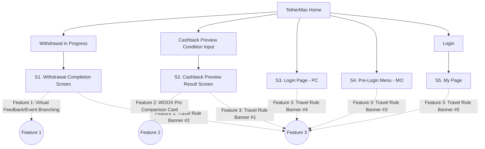
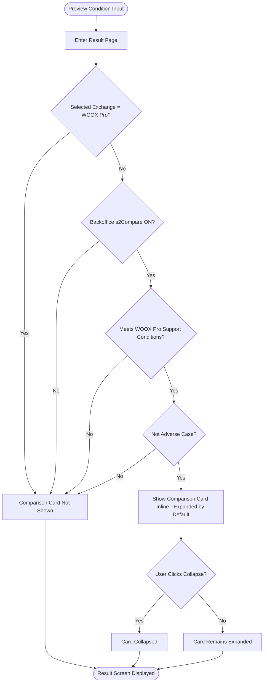
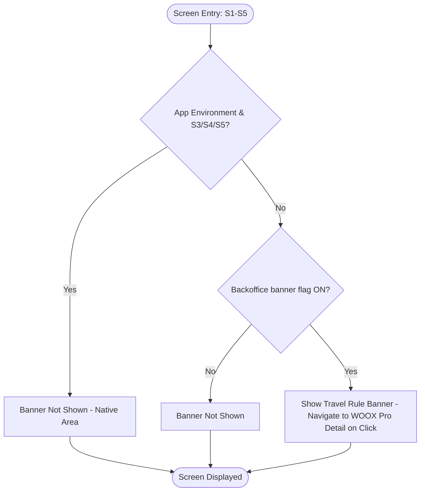

# Information Architecture (IA)

| Item | Content |
|---|---|
| Project Name | WOOX Pro Onboarding Anniversary 30-Day Intensive Promotion |
| Date | 2026-07-03 |
| Version | v1.0 |
| Reference Documents | 02.기획문서/기능명세서_FE_EN.md, 02.기획문서/화면변경목록_EN.md, PRD_EN.md |

> This project is not about building a new site — it **adds nudge features to 5 existing screens (S1-S5) of the existing TetherMax platform**. The sitemap below does not represent the entire IA; it shows only the points where this project intervenes. Actual URL paths follow the existing platform routing, and the URLs in this document are illustrative notation only (⚠️ actual routes need to be confirmed when FE development begins).

---

## 1. Full Sitemap (Project Intervention Points)



- S1/S2 are common to Web PC, Web MO, and App (webview)
- S3/S4/S5 apply to Web (PC/MO) only — for App, these screens are native areas and are out of scope for this project (see 화면변경목록_EN.md §1)

---

## 2. User Flow

### 2.1 Feature 1 — Virtual Feedback / Event Branching After Withdrawal Completion

```mermaid
flowchart TD
    Start([Withdrawal Request]) --> Complete[Withdrawal Complete]
    Complete --> CheckPromo{Backoffice s1Feedback ON?}
    CheckPromo -->|No| BaseAd[Show Existing Event Ad]
    CheckPromo -->|Yes| CheckWoox{Withdrawal Includes WOOX Pro?}

    CheckWoox -->|No| CheckSaving{Not Adverse Case &amp; Saving Amount Calculable?}
    CheckSaving -->|Yes| VirtualFeedback[Show Virtual Feedback Card]
    CheckSaving -->|No| CheckOnb1{Onboarding Event Active?}
    CheckOnb1 -->|Yes| OnbEvt1[Show Onboarding Event]
    CheckOnb1 -->|No| BaseAd

    CheckWoox -->|Yes| CheckTM{TetherMax-type Event Active?}
    CheckTM -->|Yes| TMEvt[Show TetherMax-type Event]
    CheckTM -->|No| CheckWith{WOOX Pro "with-type" Event Active?}
    CheckWith -->|Yes| WithEvt[Show WOOX Pro "with-type" Event]
    CheckWith -->|No| BaseB[Existing Base Event Logic]

    VirtualFeedback --> End([Screen Displayed])
    OnbEvt1 --> End
    TMEvt --> End
    WithEvt --> End
    BaseB --> End
    BaseAd --> End
```

### 2.2 Feature 2 — Cashback Preview WOOX Pro Comparison Card



### 2.3 Feature 3 — Travel Rule Integration Banner (Common to 5 Locations)



---

## 3. Screen-Feature Mapping

| Screen Name | URL (Example, Actual Route TBC) | Key Features | Related Feature IDs |
|---|---|---|---|
| S1. Withdrawal Completion Screen | /withdraw/complete | Virtual Feedback/Event Branching Display, Travel Rule Banner #2 | F-001, F-002, F-004, F-005 |
| S2. Cashback Preview Result Screen | /cashback-preview/result | WOOX Pro Comparison Card (Inline), Travel Rule Banner #1 | F-003, F-004, F-005 |
| S3. Login Page (PC) | /login | Travel Rule Banner #4 | F-004, F-005 |
| S4. Pre-Login Menu (MO) | / (Global Menu) | Travel Rule Banner #3 | F-004, F-005 |
| S5. My Page (Post-Login) | /mypage | Travel Rule Banner #5 | F-004, F-005 |
| B1. Visibility Control (Backoffice) | Admin GNB: **Event > WOOX pro sub** (newly added at the bottom) | Read/save on/off of the 5 promotion areas | F-005 (A-001~A-003) |

> F-005 (Promotion Active Status Determination) is a gate commonly referenced by all 5 screens, so it is included in every row.
> B1 is not a user screen but an admin backoffice page, newly added as a 'WOOX pro sub' item at the bottom of the existing admin 'Event' menu (no new top-level menu).
